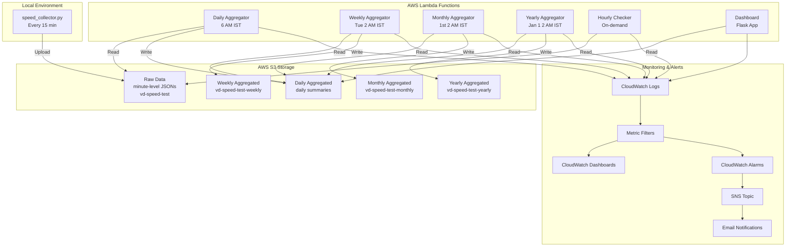
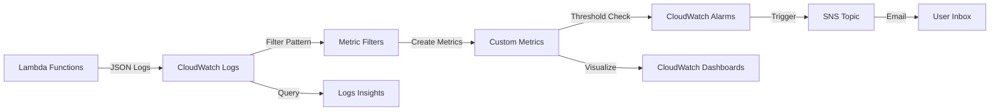
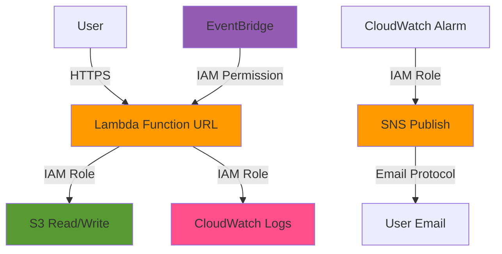

# 🚀 vd-speed-test — Enterprise Internet Speed Monitoring System

[]()
[]()
[]()
[]()

> **Automated internet speed monitoring with 15-minute granularity, AWS serverless architecture, anomaly detection, and enterprise-grade observability.**

---

## 🎯 Key Features

| Feature | Description |
|---------|-------------|
| **📊 Automated Collection** | Runs every 15 minutes, captures Ookla CLI results |
| **☁️ Serverless Architecture** | 3 AWS Lambda functions with EventBridge scheduling |
| **�️ Multi-Host Support** | Deploy collectors on multiple machines, view per-host or global stats |
| **🔍 Anomaly Detection** | Automatic detection of performance drops and outages |
| **📈 Interactive Dashboard** | Real-time visualization with host filtering and advanced filters |
| **🚨 CloudWatch Integration** | JSON structured logging with pre-built queries |
| **📱 Mobile Responsive** | Access dashboard from any device |
| **🎯 Threshold Monitoring** | Configurable speed expectations with alerts |
| **🔄 Multi-Level Aggregation** | Hourly, Daily, Weekly, Monthly, Yearly summaries |
| **⚡ Async Loading** | Instant page load with `async=1` parameter |
| **�️ Smart Caching** | 2-minute TTL cache with force refresh option |
| **🚀 Parallel Fetches** | ThreadPoolExecutor for fast S3 data loading |
| **�📊 Advanced Metrics** | Custom CloudWatch metrics with filtering |
| **⚠️ Smart Alarms** | Multi-level alerting with SNS notifications |
| **⏰ Hourly Insights** | Automated hourly aggregation with partial data support |

---

## 📦 Project Structure

```
vd-speed-test/
├── 🖥️ LOCAL COLLECTOR
│   ├── speed_collector.py            # 15-min speed test runner
│   ├── speedtest.exe                 # Ookla CLI for Windows
│   └── speed_collector_autostart.xml # Windows Task Scheduler config
│
├── ☁️ AWS LAMBDA FUNCTIONS
│   ├── lambda_function.py            # Daily aggregator (6 AM IST)
│   ├── lambda_hourly_check.py        # Coverage checker
│   └── lambda_dashboard.py           # Flask dashboard wrapper
│
├── 🌐 WEB DASHBOARD
│   ├── app.py                        # Flask application
│   ├── templates/dashboard.html      # Interactive UI
│   └── config.json                   # Speed thresholds
│
├── 🚀 DEPLOYMENT
│   ├── template.yaml                 # SAM template with CloudWatch
│   ├── samconfig.toml               # Deployment configuration
│   └── requirements.txt             # Python dependencies
│
└── 📚 DOCUMENTATION
    ├── README.md                     # This guide
    └── vd-speed-test-architecture.svg
```

---

## 🏗️ System Architecture

### 📐 High-Level Architecture


*Complete system architecture showing data flow from local collector to AWS services*

### 🔄 Data Flow Diagram



### 🎯 Component Responsibilities

| Component | Purpose | Schedule | Output |
|-----------|---------|----------|--------|
| **Speed Collector** | Runs Ookla speedtest, uploads to S3 | Every 15 min (local) | Raw JSON files |
| **Hourly Aggregator** | Computes hourly stats from 15-min data | Every hour at :10 | `hourly_summary_YYYYMMDDHH.json` |
| **Daily Aggregator** | Computes daily stats from raw data | 6:00 AM IST | `speed_summary_YYYYMMDD.json` |
| **Weekly Aggregator** | Rolls up daily data to weekly | Tue 2:00 AM IST | `speed_summary_week_YYYYWW.json` |
| **Monthly Aggregator** | Rolls up daily data to monthly | 1st 2:00 AM IST | `speed_summary_month_YYYYMM.json` |
| **Yearly Aggregator** | Rolls up daily data to yearly | Jan 1 2:00 AM IST | `speed_summary_year_YYYY.json` |
| **Hourly Checker** | Counts records per hour | On-demand (API) | Coverage statistics JSON |
| **Dashboard** | Visualizes aggregated data | Always available | Interactive web UI |

### 📊 Monitoring Architecture



### 🔐 Security Architecture



**Security Features**:
- ✅ IAM roles with least privilege
- ✅ No hardcoded credentials
- ✅ Function URLs with CORS
- ✅ S3 bucket policies
- ✅ CloudWatch log encryption
- ✅ SNS topic with email filtering

---

## 🏗️ Detailed Architecture Breakdown

## 🚀 Quick Start Guide

### Prerequisites

- Python 3.12+
- AWS Account with configured credentials
- Windows/Mac/Linux system
- Ookla Speedtest CLI

### 1️⃣ Clone & Setup

```bash
git clone https://github.com/varadharajaan/internet-speed-tester.git
cd internet-speed-tester

# Create virtual environment
python -m venv .venv
.venv\Scripts\activate  # Windows
source .venv/bin/activate  # Mac/Linux

# Install dependencies
pip install -r requirements.txt
```

### 2️⃣ Configure AWS

```bash
aws configure
# Enter: Access Key, Secret Key, Region (ap-south-1)

# Verify
aws sts get-caller-identity
```

### 3️⃣ Run Speed Test

```bash
python speed_collector.py
```

### 4️⃣ Deploy to AWS

```bash
# Install SAM CLI
pip install aws-sam-cli

# Build and deploy
sam build
sam deploy --guided

# Follow prompts:
# Stack Name: vd-speedtest-stack
# Region: ap-south-1
# Parameters: Accept defaults or customize
```

### 5️⃣ Access Dashboard

```bash
# Local
python app.py
# Open: http://localhost:8080

# AWS Lambda URL (after deployment)
# https://your-dashboard-url.lambda-url.ap-south-1.on.aws/
```

### 6️⃣ Access Monitoring Tools

After deployment, get all URLs:

```bash
# Get all stack outputs with URLs
aws cloudformation describe-stacks \
  --stack-name vd-speedtest-stack \
  --query 'Stacks[0].Outputs' \
  --output table
```

**Quick Access Links** (replace region/account as needed):

```bash
# CloudWatch Main Dashboard
https://console.aws.amazon.com/cloudwatch/home?region=ap-south-1#dashboards:name=vd-speedtest-main-prod

# CloudWatch Performance Dashboard  
https://console.aws.amazon.com/cloudwatch/home?region=ap-south-1#dashboards:name=vd-speedtest-performance-prod

# CloudWatch Logs Insights
https://console.aws.amazon.com/cloudwatch/home?region=ap-south-1#logsV2:logs-insights

# CloudWatch Alarms
https://console.aws.amazon.com/cloudwatch/home?region=ap-south-1#alarmsV2:

# S3 Console (vd-speed-test bucket)
https://s3.console.aws.amazon.com/s3/buckets/vd-speed-test?region=ap-south-1

# Lambda Functions Console
https://console.aws.amazon.com/lambda/home?region=ap-south-1#/functions
```

---

## 🎯 Complete Feature Overview

### ✨ What's New in Latest Version

| Feature | Description | How to Access |
|---------|-------------|---------------|
| **🔄 Multi-Level Aggregation** | Hourly, Daily, Weekly, Monthly, Yearly roll-ups | EventBridge schedules in AWS Console |
| **📊 Advanced Metrics** | 8+ custom CloudWatch metrics | CloudWatch → Metrics → `vd-speed-test/Logs` |
| **🔍 Query Definitions** | 4 pre-built Logs Insights queries | CloudWatch → Logs Insights → Saved queries |
| **⚠️ Smart Alarms** | 7 configured alarms with SNS | CloudWatch → Alarms → vd-speedtest-* |
| **📈 Dual Dashboards** | Main + Performance dashboards | CloudWatch → Dashboards |
| **📧 Email Notifications** | Automatic alarm emails via SNS | Check your email inbox |
| **🗂️ Separate S3 Buckets** | Dedicated buckets per aggregation level | S3 Console → vd-speed-test-* |
| **⚙️ Configurable Schedules** | Customize via template parameters | SAM template → Parameters |
| **⏱️ Hourly Insights** | Automatic hourly aggregation at :10 past each hour | S3 hourly bucket + Dashboard |
| **📊 6-Mode Dashboard** | View data as: 15-min, Hourly, Daily, Weekly, Monthly, Yearly | Dashboard dropdown selector |
| **🔧 Partial Data Handling** | Works even with incomplete hourly data (1-4 files) | Automatic in hourly aggregation |

---

## 📊 Enhanced Dashboard Features

### 🔍 Advanced Filtering System

| Filter Type | Description | Example |
|------------|-------------|---------|
| **Date Range** | Custom time period selection | Last 7 days |
| **Speed Range** | Min/max download/upload/ping | 100-200 Mbps |
| **Provider Search** | Filter by ISP name | "Airtel", "ACT" |
| **IP Filtering** | Search by public IP | "223.178.*" |
| **Quick Filters** | One-click common filters | Below threshold |

### 📈 Interactive Visualizations

- **Zoom & Pan**: Mouse wheel zoom on charts
- **Anomaly Highlighting**: Red markers for issues
- **Threshold Lines**: Visual speed expectations
- **Responsive Design**: Mobile-optimized UI
- **Multi-Mode Views**: Switch between 6 different time granularities

### 🎯 Dashboard Viewing Modes

The dashboard now supports **6 different viewing modes** for flexible data analysis:

| Mode | Description | Time Range | Data Source |
|------|-------------|------------|-------------|
| **15-min** | Raw minute-level data | Last 1-360 days | `vd-speed-test` |
| **Hourly** | Hourly aggregations (NEW) | Last 1-90 days | `vd-speed-test-hourly-prod` |
| **Daily** | Daily summaries | Last 1-360 days | `vd-speed-test` aggregated |
| **Weekly** | Weekly roll-ups | Last 1-360 days | `vd-speed-test-weekly-prod` |
| **Monthly** | Monthly roll-ups | Last 1-360 days | `vd-speed-test-monthly-prod` |
| **Yearly** | Yearly roll-ups | All years | `vd-speed-test-yearly-prod` |

**Dashboard Features by Mode**:
- Dynamic table headers (Timestamp/Hour/Date/Week/Month/Year)
- Mode-specific summary cards (Hours/Days/Weeks/Months/Years below threshold)
- Contextual threshold labels ("for hour", "for day", "for week", etc.)
- Automatic data loading from appropriate S3 bucket

### 🎯 Real-time Metrics

```javascript
// Dashboard provides:
- Average speeds (download/upload/ping)
- Completion rates (% of expected tests)
- Anomaly detection (automatic flagging)
- Provider analytics (most used servers)
- Historical trends (daily/hourly views)
```

---

## 📊 Multi-Level Data Aggregation

### 🔄 Aggregation Hierarchy

The system implements a sophisticated multi-level aggregation strategy to provide insights at different time scales:

```
Minute-level Data (Raw)
    ↓
Hourly Aggregation (Every hour at :10)
    ↓
Daily Aggregation (6:00 AM IST)
    ↓
Weekly Aggregation (Tuesday 2:00 AM IST)
    ↓
Monthly Aggregation (1st 2:00 AM IST)
    ↓
Yearly Aggregation (Jan 1 2:00 AM IST)
```

### 📅 Aggregation Schedules

| Aggregation | Schedule | Description | Output Bucket |
|-------------|----------|-------------|---------------|
| **Hourly** | `cron(10 * * * ? *)` | Every hour at :10 | `vd-speed-test-hourly-prod/` |
| **Daily** | `cron(30 0 * * ? *)` | 6:00 AM IST daily | `vd-speed-test/aggregated/` |
| **Weekly** | `cron(30 20 ? * MON *)` | Tuesday 2:00 AM IST | `vd-speed-test-weekly-prod/` |
| **Monthly** | `cron(30 20 L * ? *)` | 1st of month 2:00 AM IST | `vd-speed-test-monthly-prod/` |
| **Yearly** | `cron(30 20 31 12 ? *)` | Jan 1 2:00 AM IST | `vd-speed-test-yearly-prod/` |

### ⏰ Hourly Aggregation Details

**NEW Feature**: Automated hourly aggregation runs at **10 minutes past each hour** (00:10, 01:10, 02:10, etc.)

**Why 10 minutes past?**
- Speed tests run at :00, :15, :30, :45 of each hour
- 10-minute buffer ensures all 4 data points are uploaded
- Aggregation proceeds even with partial data (1-4 files found)

**Partial Data Handling**:
```python
# Works with ANY available data
- 4/4 files: ✅ 100% complete (ideal)
- 3/4 files: ✅ 75% complete (still useful)
- 2/4 files: ✅ 50% complete (acceptable)
- 1/4 files: ✅ 25% complete (minimal but valid)
- 0/4 files: ❌ Skip aggregation
```

**Example Timeline**:
```
14:00 - Speed test runs (1st data point)
14:15 - Speed test runs (2nd data point)
14:30 - Speed test runs (3rd data point)
14:45 - Speed test runs (4th data point)
15:10 - Hourly aggregation runs for 14:00-14:59 period
```

### 📦 S3 Bucket Structure

```
# Raw minute-level data
s3://vd-speed-test/
  └── year=2025/
      └── month=202501/
          └── day=20250125/
              └── hour=2025012512/
                  └── minute=202501251215/
                      └── speed_data_ookla_*.json

# Hourly aggregated data (NEW)
s3://vd-speed-test-hourly-prod/aggregated/
  └── year=2025/
      └── month=202501/
          └── day=20250125/
              └── hour=2025012514/
                  └── hourly_summary_2025012514.json

# Daily aggregated data
s3://vd-speed-test/aggregated/
  └── year=2025/
      └── month=202501/
          └── day=20250125/
              └── speed_summary_20250125.json

# Weekly aggregated data  
s3://vd-speed-test-weekly-prod/aggregated/
  └── year=2025/
      └── week=202504/
          └── speed_summary_week_202504.json

# Monthly aggregated data
s3://vd-speed-test-monthly-prod/aggregated/
  └── year=2025/
      └── month=202501/
          └── speed_summary_month_202501.json

# Yearly aggregated data
s3://vd-speed-test-yearly-prod/aggregated/
  └── year=2025/
      └── speed_summary_year_2025.json
```

### 🗄️ S3 Bucket Lifecycle Policies

| Bucket | Purpose | Retention Policy | Est. Size |
|--------|---------|------------------|-----------|
| `vd-speed-test` | Raw 15-min data | User-managed | ~50 MB/day |
| `vd-speed-test-hourly-prod` | Hourly summaries | 90 days | ~2 MB/day |
| `vd-speed-test-weekly-prod` | Weekly summaries | 730 days (2 years) | ~50 KB/week |
| `vd-speed-test-monthly-prod` | Monthly summaries | 1825 days (5 years) | ~15 KB/month |
| `vd-speed-test-yearly-prod` | Yearly summaries | 3650 days (10 years) | ~5 KB/year |

### 🎯 Aggregation Metrics

Each aggregation level computes:

- **Average Speeds**: Download, Upload, Ping
- **Min/Max Values**: Performance extremes
- **Percentiles**: P50, P75, P90, P95, P99
- **Anomaly Counts**: Below-threshold incidents
- **Data Quality**: Completion rates, gaps
- **Provider Analytics**: Most used servers, ISP distribution

### 🚀 Manual Aggregation Triggers

You can manually trigger aggregations using Lambda function URLs:

```bash
# Trigger hourly aggregation (NEW)
curl -X POST "https://[your-aggregator-url]/" \
  -H "Content-Type: application/json" \
  -d '{"mode":"hourly"}'

# Trigger daily aggregation
curl -X POST "https://[your-aggregator-url]/" \
  -H "Content-Type: application/json" \
  -d '{"mode":"daily"}'

# Trigger weekly aggregation
curl -X POST "https://[your-aggregator-url]/" \
  -H "Content-Type: application/json" \
  -d '{"mode":"weekly"}'

# Trigger monthly aggregation
curl -X POST "https://[your-aggregator-url]/" \
  -H "Content-Type: application/json" \
  -d '{"mode":"monthly"}'

# Trigger yearly aggregation
curl -X POST "https://[your-aggregator-url]/" \
  -H "Content-Type: application/json" \
  -d '{"mode":"yearly"}'
```

### 🔧 Customizing Schedules

To modify aggregation schedules, update the `template.yaml` parameters:

```yaml
Parameters:
  HourlyScheduleExpression:
    Type: String
    Default: cron(10 * * * ? *)  # Every hour at :10
  DailyScheduleExpression:
    Type: String
    Default: cron(30 0 * * ? *)
  WeeklyScheduleExpression:
    Type: String
    Default: cron(30 20 ? * MON *)
  MonthlyScheduleExpression:
    Type: String
    Default: cron(30 20 L * ? *)
  YearlyScheduleExpression:
    Type: String
    Default: cron(30 20 31 12 ? *)
```

---

## 📊 CloudWatch Metrics & Monitoring

### 📈 Custom Metric Filters

The system automatically creates CloudWatch metrics from logs:

| Metric Name | Namespace | Description | Source |
|-------------|-----------|-------------|--------|
| **AggregatorErrors** | `vd-speed-test/Logs` | Error count in aggregator | Lambda logs |
| **AggregatorWarnings** | `vd-speed-test/Logs` | Warning count in aggregator | Lambda logs |
| **AggregatorSuccess** | `vd-speed-test/Logs` | Successful completions | Lambda logs |
| **DashboardErrors** | `vd-speed-test/Logs` | Dashboard application errors | Lambda logs |
| **DashboardWarnings** | `vd-speed-test/Logs` | Dashboard warnings | Lambda logs |
| **HourlyCheckerErrors** | `vd-speed-test/Logs` | Checker function errors | Lambda logs |
| **HourlyCheckerWarnings** | `vd-speed-test/Logs` | Checker warnings | Lambda logs |
| **DataCollectionRuns** | `vd-speed-test/Logs` | Aggregation run count | Lambda logs |

### 📊 CloudWatch Dashboards

Two comprehensive dashboards are automatically created:

#### 1️⃣ Main Monitoring Dashboard

**Access URL**: `https://console.aws.amazon.com/cloudwatch/home?region=ap-south-1#dashboards:name=vd-speedtest-main-prod`

**Widgets Include**:
- Aggregator status (Errors, Warnings, Success)
- Lambda invocations for all functions
- Lambda errors across all functions
- Real-time metric visualization

#### 2️⃣ Performance Dashboard

**Access URL**: `https://console.aws.amazon.com/cloudwatch/home?region=ap-south-1#dashboards:name=vd-speedtest-performance-prod`

**Widgets Include**:
- Lambda execution duration (ms)
- Lambda throttles
- Memory utilization
- Cost analysis metrics

### 📸 Dashboard Screenshot Examples

**Main Monitoring Dashboard**:


*Example CloudWatch dashboard showing aggregator metrics, invocations, and errors*

**Performance Dashboard**:


*Example performance dashboard with Lambda duration and throttle metrics*

### 🔍 Accessing Dashboards

```bash
# Get dashboard URLs from CloudFormation outputs
aws cloudformation describe-stacks \
  --stack-name vd-speedtest-stack \
  --query 'Stacks[0].Outputs[?OutputKey==`MainDashboardUrl`].OutputValue' \
  --output text

# Or navigate manually in AWS Console:
# 1. Open CloudWatch Console
# 2. Click "Dashboards" in left menu
# 3. Select "vd-speedtest-main-prod" or "vd-speedtest-performance-prod"
```

---

## 🔍 CloudWatch Logs Insights Queries

### 📊 Pre-configured Query Definitions

The system includes ready-to-use CloudWatch Logs Insights queries:

#### 1️⃣ Aggregator Anomalies Query

**Query Name**: `vd-speedtest-aggregator-anomalies`

```sql
fields @timestamp, @message
| filter level = "WARNING" and message like /anomaly|degradation|threshold/i
| sort @timestamp desc
| limit 50
```

**Purpose**: Detect performance issues and speed degradations

**Access**: 
```
https://console.aws.amazon.com/cloudwatch/home?region=ap-south-1#logsV2:logs-insights
```

#### 2️⃣ All Functions Error Summary

**Query Name**: `vd-speedtest-all-errors`

```sql
fields @timestamp, @logStream, @message, level
| filter level = "ERROR"
| stats count(*) as error_count by @logStream
| sort error_count desc
```

**Purpose**: System-wide error overview across all Lambda functions

**Log Groups**:
- `/aws/lambda/vd-speedtest-daily-aggregator-prod`
- `/aws/lambda/vd-speedtest-dashboard-prod`
- `/aws/lambda/vd-speedtest-hourly-checker-prod`

#### 3️⃣ Performance Metrics Query

**Query Name**: `vd-speedtest-performance`

```sql
fields @timestamp, message
| filter message like /Completed/
| parse message /Completed: (?<function>[^ ]+) in (?<duration>[0-9.]+)s/
| stats avg(duration) as avg_seconds by function
```

**Purpose**: Analyze Lambda execution performance and identify slow functions

#### 4️⃣ Dashboard Errors Query

**Query Name**: `vd-speedtest-dashboard-errors`

```sql
fields @timestamp, @message
| filter level = "ERROR"
| sort @timestamp desc
| limit 50
```

**Purpose**: Monitor dashboard-specific errors and issues

### 🚀 Running Queries

**Via AWS Console**:

1. Navigate to CloudWatch → Logs Insights
2. Select log group(s)
3. Choose saved query from dropdown
4. Select time range
5. Click "Run query"

**Via AWS CLI**:

```bash
# Start a query
aws logs start-query \
  --log-group-name "/aws/lambda/vd-speedtest-daily-aggregator-prod" \
  --start-time $(date -u -d '1 hour ago' +%s) \
  --end-time $(date -u +%s) \
  --query-string 'fields @timestamp, @message | filter level = "ERROR" | limit 50'

# Get query results (use queryId from previous command)
aws logs get-query-results --query-id <queryId>
```

### 📊 Custom Query Examples

**Find speed test failures**:
```sql
fields @timestamp, message
| filter message like /failed|error|exception/i
| stats count() by bin(5m)
```

**Analyze aggregation duration**:
```sql
fields @timestamp, message
| filter message like /Completed: daily_aggregation/
| parse message /in (?<duration>[0-9.]+)s/
| stats avg(duration), max(duration), min(duration)
```

**Data collection gaps**:
```sql
fields @timestamp, message
| filter message like /No data found|missing|gap/i
| sort @timestamp desc
```

---

## ⚠️ CloudWatch Alarms & Notifications

### 🚨 Alarm Configuration

The system includes 8 pre-configured CloudWatch alarms:

| Alarm Name | Metric | Threshold | Description |
|------------|--------|-----------|-------------|
| **vd-speedtest-aggregator-errors** | AggregatorErrors | > 3 in 1 hour | Aggregator function errors |
| **vd-speedtest-aggregator-warnings** | AggregatorWarnings | > 10 in 1 day | Excessive warnings |
| **vd-speedtest-dashboard-errors** | DashboardErrors | > 5 in 1 hour | Dashboard application errors |
| **vd-speedtest-checker-errors** | HourlyCheckerErrors | > 3 in 1 hour | Hourly checker errors |
| **vd-speedtest-lambda-aggregator-error** | Lambda Errors | > 1 in 1 hour | Lambda function failures |
| **vd-speedtest-lambda-dashboard-error** | Lambda Errors | > 5 in 1 hour | Dashboard Lambda failures |
| **vd-speedtest-data-collection-failure** | DataCollectionRuns | < 1 in 2 days | No data collected |

### 📧 SNS Email Notifications

**Setup Steps**:

1. **Deploy the stack** - SNS topic is created automatically
2. **Check your email** - Look for "AWS Notification - Subscription Confirmation"
3. **Click "Confirm subscription"** - Activate email alerts
4. **Verify** - You'll receive "Subscription confirmed" message

**SNS Topic**: `vd-speedtest-alerts-prod`

**Notification Format**:
```
You are receiving this email because your Amazon CloudWatch Alarm 
"vd-speedtest-aggregator-errors-prod" in the AP-SOUTH-1 region 
has entered the ALARM state.

Alarm Details:
- AlarmName: vd-speedtest-aggregator-errors-prod
- AlarmDescription: Alert when aggregator has errors
- State Change: OK -> ALARM
- Reason: Threshold Crossed: 1 datapoint [5.0] was greater than 
  the threshold (3.0).
```

### 🔧 Configuring Alarms

**Update email address**:
```bash
sam deploy --parameter-overrides NotificationEmail=your-email@example.com
```

**Modify alarm thresholds in `template.yaml`**:
```yaml
AggregatorErrorAlarm:
  Type: AWS::CloudWatch::Alarm
  Properties:
    AlarmName: !Sub 'vd-speedtest-aggregator-errors-${Environment}'
    MetricName: AggregatorErrors
    Threshold: 3              # Modify this value
    Period: 3600              # 1 hour in seconds
    EvaluationPeriods: 1
```

### 📊 Viewing Alarm Status

**AWS Console**:
```
https://console.aws.amazon.com/cloudwatch/home?region=ap-south-1#alarmsV2:
```

**AWS CLI**:
```bash
# List all alarms
aws cloudwatch describe-alarms \
  --alarm-name-prefix vd-speedtest

# Get specific alarm details
aws cloudwatch describe-alarms \
  --alarm-names vd-speedtest-aggregator-errors-prod

# Check alarm history
aws cloudwatch describe-alarm-history \
  --alarm-name vd-speedtest-aggregator-errors-prod \
  --max-records 10
```

### 🔕 Alarm Actions

When an alarm triggers, it automatically:
1. ✉️ Sends email notification via SNS
2. 📊 Updates CloudWatch dashboard status
3. 📝 Logs state change to alarm history
4. 🔔 Can trigger additional actions (Lambda, Auto Scaling, etc.)

When alarm returns to OK state:
1. ✅ Sends "OK" notification email
2. 📊 Updates dashboard to green status
3. 📝 Records resolution in history

### 🎯 Alarm Best Practices

1. **Test alarms**: Manually trigger errors to verify notifications work
2. **Tune thresholds**: Adjust based on your actual traffic patterns
3. **Set up escalations**: Configure multiple notification channels
4. **Regular reviews**: Check alarm history weekly
5. **Document responses**: Create runbooks for each alarm type

---

## 📡 API Endpoints & Function URLs

### 🔗 Lambda Function URLs

After deployment, you'll receive these endpoints:

```bash
# Get all function URLs from stack outputs
aws cloudformation describe-stacks \
  --stack-name vd-speedtest-stack \
  --query 'Stacks[0].Outputs' \
  --output table
```

### 📊 Dashboard Function

**URL Format**: `https://[random-id].lambda-url.ap-south-1.on.aws/`

| Endpoint | Method | Description | Example |
|----------|--------|-------------|---------|
| `/` | GET | Main dashboard UI | `https://[url]/` |
| `/api/data` | GET | JSON data endpoint | `https://[url]/api/data` |
| `/?mode=minute&days=7` | GET | 15-minute granularity view | `https://[url]/?mode=minute&days=7` |
| `/?mode=hourly&days=7` | GET | Hourly aggregation view (NEW) | `https://[url]/?mode=hourly&days=7` |
| `/?mode=daily&days=30` | GET | Daily aggregation view | `https://[url]/?mode=daily&days=30` |
| `/?mode=weekly&days=90` | GET | Weekly aggregation view | `https://[url]/?mode=weekly&days=90` |
| `/?mode=monthly&days=180` | GET | Monthly aggregation view | `https://[url]/?mode=monthly&days=180` |
| `/?mode=yearly&days=360` | GET | Yearly aggregation view | `https://[url]/?mode=yearly&days=360` |
| `/?threshold=150` | GET | Custom threshold view | `https://[url]/?threshold=150` |
| `/?date=2025-01-25` | GET | Specific date view | `https://[url]/?date=2025-01-25` |

### 🔄 Aggregator Function

**URL Format**: `https://[random-id].lambda-url.ap-south-1.on.aws/`

| Mode | Method | Payload | Description |
|------|--------|---------|-------------|
| Hourly | POST | `{"mode":"hourly"}` | Aggregate previous hour's data |
| Daily | POST | `{"mode":"daily"}` | Aggregate yesterday's data |
| Weekly | POST | `{"mode":"weekly"}` | Aggregate last week |
| Monthly | POST | `{"mode":"monthly"}` | Aggregate last month |
| Yearly | POST | `{"mode":"yearly"}` | Aggregate last year |

**Example Usage**:
```bash
# Hourly aggregation (NEW)
curl -X POST "https://[aggregator-url]/" \
  -H "Content-Type: application/json" \
  -d '{"mode":"hourly"}'

# Daily aggregation
curl -X POST "https://[aggregator-url]/" \
  -H "Content-Type: application/json" \
  -d '{"mode":"daily"}'

# Weekly aggregation with date override
curl -X POST "https://[aggregator-url]/" \
  -H "Content-Type: application/json" \
  -d '{"mode":"weekly","date":"2025-01-20"}'
```

### ⏰ Hourly Checker Function

**URL Format**: `https://[random-id].lambda-url.ap-south-1.on.aws/`

| Parameter | Type | Description | Example |
|-----------|------|-------------|---------|
| `date` | Query | Date to check (YYYY-MM-DD) | `?date=2025-01-25` |

**Example Usage**:
```bash
# Check coverage for specific date
curl "https://[checker-url]/?date=2025-01-25"

# Response format
{
  "date": "2025-01-25",
  "total_hours": 24,
  "hours_with_data": 23,
  "total_records": 92,
  "coverage_percent": 95.8,
  "hourly_breakdown": {
    "00": 4,
    "01": 4,
    "02": 4,
    ...
  }
}
```

---

## 📊 Data Storage Structure

```
s3://vd-speed-test/
├── year=2025/
│   └── month=202501/
│       └── day=20250110/
│           └── hour=2025011012/
│               └── minute=202501101215/
│                   └── speed_data_ookla_*.json
└── aggregated/
    └── year=2025/
        └── month=202501/
            └── day=20250110/
                └── speed_summary_20250110.json

s3://vd-speed-test-hourly-prod/
└── aggregated/
    └── year=2025/
        └── month=202501/
            └── day=20250110/
                └── hour=2025011014/
                    └── hourly_summary_2025011014.json

s3://vd-speed-test-weekly-prod/
└── aggregated/
    └── year=2025/
        └── week=202504/
            └── speed_summary_week_202504.json

s3://vd-speed-test-monthly-prod/
└── aggregated/
    └── year=2025/
        └── month=202501/
            └── speed_summary_month_202501.json

s3://vd-speed-test-yearly-prod/
└── aggregated/
    └── year=2025/
        └── speed_summary_year_2025.json
```

---

## ⚙️ Configuration

### 🔧 Template Parameters

Configure the system via `template.yaml` parameters during deployment:

| Parameter | Type | Default | Description |
|-----------|------|---------|-------------|
| **NotificationEmail** | String | `varathu09@gmail.com` | Email for alarm notifications |
| **S3BucketName** | String | `vd-speed-test` | Main bucket for raw data |
| **Environment** | String | `prod` | Environment name (dev/prod) |
| **HourlyScheduleExpression** | Cron | `cron(10 * * * ? *)` | Hourly aggregation (every hour at :10) |
| **DailyScheduleExpression** | Cron | `cron(30 0 * * ? *)` | Daily aggregation schedule (6 AM IST) |
| **WeeklyScheduleExpression** | Cron | `cron(30 20 ? * MON *)` | Weekly aggregation (Tue 2 AM IST) |
| **MonthlyScheduleExpression** | Cron | `cron(30 20 L * ? *)` | Monthly aggregation (1st 2 AM IST) |
| **YearlyScheduleExpression** | Cron | `cron(30 20 31 12 ? *)` | Yearly aggregation (Jan 1 2 AM IST) |
| **ExpectedSpeedMbps** | Number | `200` | Expected internet speed |
| **TolerancePercent** | Number | `10` | Speed variance tolerance |

### 📝 config.json

Local configuration file for speed thresholds:

```json
{
  "expected_speed_mbps": 200,
  "tolerance_percent": 10,
  "log_level": "INFO",
  "retention_days": 30,
  "s3_bucket": "vd-speed-test",
  "s3_bucket_hourly": "vd-speed-test-hourly-prod",
  "s3_bucket_weekly": "vd-speed-test-weekly-prod",
  "s3_bucket_monthly": "vd-speed-test-monthly-prod",
  "s3_bucket_yearly": "vd-speed-test-yearly-prod"
}
```

### 🌍 Environment Variables

Automatically set by SAM template:

| Variable | Description | Example Value |
|----------|-------------|---------------|
| `S3_BUCKET` | Main raw data bucket | `vd-speed-test` |
| `S3_BUCKET_HOURLY` | Hourly aggregation bucket | `vd-speed-test-hourly-prod` |
| `S3_BUCKET_WEEKLY` | Weekly aggregation bucket | `vd-speed-test-weekly-prod` |
| `S3_BUCKET_MONTHLY` | Monthly aggregation bucket | `vd-speed-test-monthly-prod` |
| `S3_BUCKET_YEARLY` | Yearly aggregation bucket | `vd-speed-test-yearly-prod` |
| `ENVIRONMENT` | Deployment environment | `prod` |
| `AWS_REGION1` | AWS region | `ap-south-1` |
| `EXPECTED_SPEED_MBPS` | Speed threshold | `200` |
| `TOLERANCE_PERCENT` | Variance tolerance | `10` |
| `LOG_LEVEL` | Logging verbosity | `INFO` |

### 🔄 Updating Configuration

**During deployment**:
```bash
sam deploy --parameter-overrides \
  NotificationEmail=your-email@example.com \
  ExpectedSpeedMbps=300 \
  TolerancePercent=15 \
  Environment=prod
```

**After deployment (requires redeploy)**:
```bash
# Edit template.yaml or samconfig.toml
# Then redeploy
sam deploy
```

### 🪟 Windows Task Scheduler Setup

For local data collection on Windows:

1. Edit `speed_collector_autostart.xml` with your Python paths
2. Open Task Scheduler → Import Task
3. Select the modified XML file
4. Set credentials and enable the task

```xml
<Command>C:\Users\YourUser\AppData\Local\Programs\Python\Python312\pythonw.exe</Command>
<Arguments>C:\path\to\speed_collector.py</Arguments>
```

**Task runs every 15 minutes automatically** ✅

---

## 🛠️ Troubleshooting

### Common Issues & Solutions

| Issue | Solution |
|-------|----------|
| **No data in dashboard** | Check S3 permissions, verify aggregator ran, confirm SNS subscription |
| **Task Scheduler not working** | Use `pythonw.exe`, check paths, run as admin, verify network access |
| **Lambda timeout** | Increase timeout in template.yaml (currently 300s for aggregator) |
| **CloudWatch queries empty** | Wait for data collection, check log group names, verify JSON logging |
| **High AWS costs** | Reduce log retention (currently 1-3 days), optimize Lambda memory |
| **Alarms not sending emails** | Confirm SNS subscription via email link, check spam folder |
| **Weekly/Monthly aggregation failed** | Check if daily aggregations exist, verify S3 bucket permissions |
| **Dashboard shows old data** | Clear browser cache, verify aggregation schedules are enabled |
| **Missing aggregation buckets** | Redeploy stack to create missing S3 buckets |
| **Metric filters not populating** | Wait 5-10 minutes for first data, verify log format is JSON |
| **Hourly aggregation not working** | Check EventBridge rule at :10, verify hourly bucket exists, check Lambda logs |
| **Dashboard mode dropdown issues** | Ensure all 6 modes exist, check S3 bucket access, verify app.py routes |
| **Partial hourly data warnings** | Normal behavior - aggregation works with 1-4 files, no action needed |

### 🔍 Debug Commands

```bash
# Check Lambda logs in real-time
sam logs -n vd-speedtest-daily-aggregator-prod --tail

# Test aggregations locally (if you have local copies)
python lambda_function.py

# Verify S3 data and structure
aws s3 ls s3://vd-speed-test/ --recursive --summarize
aws s3 ls s3://vd-speed-test-hourly-prod/ --recursive
aws s3 ls s3://vd-speed-test-weekly-prod/ --recursive
aws s3 ls s3://vd-speed-test-monthly-prod/ --recursive
aws s3 ls s3://vd-speed-test-yearly-prod/ --recursive

# Check EventBridge rules status
aws events list-rules --name-prefix vd-speedtest

# Verify alarm status
aws cloudwatch describe-alarms --alarm-name-prefix vd-speedtest

# Check SNS subscription status
aws sns list-subscriptions-by-topic \
  --topic-arn arn:aws:sns:ap-south-1:ACCOUNT_ID:vd-speedtest-alerts-prod

# Test specific aggregation mode manually
aws lambda invoke \
  --function-name vd-speedtest-daily-aggregator-prod \
  --payload '{"mode":"daily"}' \
  output.json --cli-binary-format raw-in-base64-out

# View CloudWatch metrics
aws cloudwatch get-metric-statistics \
  --namespace vd-speed-test/Logs \
  --metric-name AggregatorErrors \
  --start-time $(date -u -d '1 day ago' +%Y-%m-%dT%H:%M:%S) \
  --end-time $(date -u +%Y-%m-%dT%H:%M:%S) \
  --period 3600 \
  --statistics Sum
```

### 🚨 Alarm Troubleshooting

**Email notifications not received**:
1. Check spam/junk folders
2. Verify SNS subscription is confirmed (check AWS Console)
3. Re-subscribe with correct email:
   ```bash
   sam deploy --parameter-overrides NotificationEmail=correct-email@example.com
   ```
4. Check SNS topic has email endpoint

**Alarms stuck in INSUFFICIENT_DATA**:
- Wait for metric data to populate (can take 5-10 minutes)
- Verify log group names match alarm configuration
- Check metric filter patterns are correct

**False positive alarms**:
- Tune thresholds in `template.yaml`
- Increase evaluation periods
- Adjust alarm period (currently 3600s = 1 hour)

### 📊 Dashboard Issues

**Dashboard not loading**:
```bash
# Check dashboard Lambda logs
sam logs -n vd-speedtest-dashboard-prod --tail

# Test dashboard endpoint
curl -I https://[your-dashboard-url]/

# Verify S3 read permissions
aws iam get-role-policy \
  --role-name vd-speedtest-dashboard-prod-role \
  --policy-name S3ReadPolicy
```

**Missing data in charts**:
- Verify aggregated data exists in S3
- Check date range filter
- Confirm aggregator Lambda ran successfully
- Review aggregator logs for errors

### 🔄 Aggregation Issues

**Daily aggregation not running**:
```bash
# Check EventBridge rule
aws events describe-rule --name vd-speedtest-daily-schedule-prod

# Manually trigger aggregation
aws lambda invoke \
  --function-name vd-speedtest-daily-aggregator-prod \
  --payload '{"mode":"daily"}' \
  out.json

# Check for errors in output
cat out.json | jq
```

**Weekly/Monthly data missing**:
1. Ensure daily aggregations completed successfully
2. Verify schedule expressions are correct (UTC vs IST)
3. Check weekly/monthly bucket permissions
4. Manually trigger to test:
   ```bash
   aws lambda invoke \
     --function-name vd-speedtest-daily-aggregator-prod \
     --payload '{"mode":"weekly"}' \
     out-weekly.json
   ```

**Hourly aggregation issues**:
1. Check EventBridge rule triggers at :10: `aws events describe-rule --name vd-speedtest-hourly-schedule-prod`
2. Verify hourly bucket exists: `aws s3 ls s3://vd-speed-test-hourly-prod/`
3. Check Lambda execution logs: `sam logs -n vd-speedtest-daily-aggregator-prod --tail`
4. Manually test: `aws lambda invoke --function-name vd-speedtest-daily-aggregator-prod --payload '{"mode":"hourly"}' out.json`
5. Verify partial data handling: Look for "Partial hour data" in logs (this is normal)

**Dashboard mode switching issues**:
1. Ensure all 5 S3 buckets exist and have data
2. Check browser console for JavaScript errors
3. Verify app.py has all 6 load functions (minute, hourly, daily, weekly, monthly, yearly)
4. Test each mode directly: `http://localhost:8080/?mode=hourly&days=7`

### 💰 Cost Optimization Tips

Current free-tier friendly settings:
- Log retention: 1-3 days (minimal storage)
- Lambda memory: 256-512 MB (optimal cost/performance)
- No NAT Gateway required (public endpoints)
- S3 lifecycle: Keep weekly 2y, monthly 5y, yearly 10y

To reduce costs further:
```bash
# Reduce log retention
aws logs put-retention-policy \
  --log-group-name /aws/lambda/vd-speedtest-dashboard-prod \
  --retention-in-days 1

# Add S3 lifecycle rules for raw data
aws s3api put-bucket-lifecycle-configuration \
  --bucket vd-speed-test \
  --lifecycle-configuration file://lifecycle.json
```

---

## 📈 Performance Optimization

### Best Practices

1. **Log Retention**: Set to 7-14 days for cost control
2. **Lambda Memory**: 512 MB for aggregator, 256 MB for checker
3. **S3 Lifecycle**: Archive old data to Glacier after 90 days
4. **Dashboard Caching**: Implement Redis for frequent queries
5. **Batch Processing**: Aggregate multiple days in parallel

### Cost Optimization

| Service | Optimization | Savings |
|---------|-------------|---------|
| **Lambda** | Right-size memory | ~30% |
| **CloudWatch** | Reduce retention | ~50% |
| **S3** | Lifecycle policies | ~40% |
| **Data Transfer** | Use VPC endpoints | ~20% |

---

## 🔮 Roadmap

- [ ] Mobile app (React Native)
- [ ] extend it to the open telemetry to collect the metrics of the host machine
- [ ] Email/SMS alerts for outages
- [ ] Multi-region support
- [ ] GraphQL API
- [ ] Prometheus/Grafana integration
- [ ] ML-based anomaly prediction
- [ ] Comparison with ISP SLA
- [ ] Network path analysis

---

## 🤝 Contributing

We welcome contributions! Please see [CONTRIBUTING.md](CONTRIBUTING.md) for guidelines.

```bash
# Fork the repo
# Create feature branch
git checkout -b feature/amazing-feature

# Commit changes
git commit -m 'Add amazing feature'

# Push and create PR
git push origin feature/amazing-feature
```

---

## 📄 License

MIT License - see [LICENSE](LICENSE) file for details.

---

## 🙏 Acknowledgments

- Ookla for Speedtest CLI
- AWS for serverless infrastructure
- Contributors and testers

---

## 📞 Support

- **Issues**: [GitHub Issues](https://github.com/varadharajaan/internet-speed-tester/issues)
- **Discussions**: [GitHub Discussions](https://github.com/varadharajaan/internet-speed-tester/discussions)
- **Email**: varadharajaan@gmail.com

---

**⭐ Star this repo if you find it useful!**

---

<p align="center">
  Made with ❤️ for reliable internet monitoring
</p>