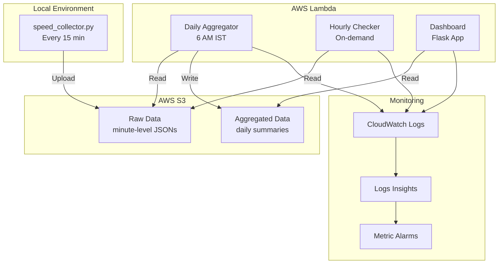

# 🚀 vd-speed-test — Enterprise Internet Speed Monitoring System

[]()
[]()
[]()
[]()

> **Automated internet speed monitoring with 15-minute granularity, AWS serverless architecture, anomaly detection, and enterprise-grade observability.**

---

## 🎯 Key Features

| Feature | Description |
|---------|-------------|
| **📊 Automated Collection** | Runs every 15 minutes, captures Ookla CLI results |
| **☁️ Serverless Architecture** | 3 AWS Lambda functions with EventBridge scheduling |
| **🔍 Anomaly Detection** | Automatic detection of performance drops and outages |
| **📈 Interactive Dashboard** | Real-time visualization with advanced filtering |
| **🚨 CloudWatch Integration** | JSON structured logging with pre-built queries |
| **📱 Mobile Responsive** | Access dashboard from any device |
| **🎯 Threshold Monitoring** | Configurable speed expectations with alerts |
| **🔄 Auto-Aggregation** | Daily summaries at 6 AM IST |

---

## 📦 Project Structure

```
vd-speed-test/
├── 🖥️ LOCAL COLLECTOR
│   ├── speed_collector.py            # 15-min speed test runner
│   ├── speedtest.exe                 # Ookla CLI for Windows
│   └── speed_collector_autostart.xml # Windows Task Scheduler config
│
├── ☁️ AWS LAMBDA FUNCTIONS
│   ├── lambda_function.py            # Daily aggregator (6 AM IST)
│   ├── lambda_hourly_check.py        # Coverage checker
│   └── lambda_dashboard.py           # Flask dashboard wrapper
│
├── 🌐 WEB DASHBOARD
│   ├── app.py                        # Flask application
│   ├── templates/dashboard.html      # Interactive UI
│   └── config.json                   # Speed thresholds
│
├── 🚀 DEPLOYMENT
│   ├── template.yaml                 # SAM template with CloudWatch
│   ├── samconfig.toml               # Deployment configuration
│   └── requirements.txt             # Python dependencies
│
└── 📚 DOCUMENTATION
    ├── README.md                     # This guide
    └── vd-speed-test-architecture.png
```

---

## 🏗️ System Architecture



---

## 🚀 Quick Start Guide

### Prerequisites

- Python 3.12+
- AWS Account with configured credentials
- Windows/Mac/Linux system
- Ookla Speedtest CLI

### 1️⃣ Clone & Setup

```bash
git clone https://github.com/varadharajaan/internet-speed-tester.git
cd internet-speed-tester

# Create virtual environment
python -m venv .venv
.venv\Scripts\activate  # Windows
source .venv/bin/activate  # Mac/Linux

# Install dependencies
pip install -r requirements.txt
```

### 2️⃣ Configure AWS

```bash
aws configure
# Enter: Access Key, Secret Key, Region (ap-south-1)

# Verify
aws sts get-caller-identity
```

### 3️⃣ Run Speed Test

```bash
python speed_collector.py
```

### 4️⃣ Deploy to AWS

```bash
# Install SAM CLI
pip install aws-sam-cli

# Build and deploy
sam build
sam deploy --guided

# Follow prompts:
# Stack Name: vd-speedtest-stack
# Region: ap-south-1
# Parameters: Accept defaults or customize
```

### 5️⃣ Access Dashboard

```bash
# Local
python app.py
# Open: http://localhost:8080

# AWS Lambda URL (after deployment)
# https://your-dashboard-url.lambda-url.ap-south-1.on.aws/
```

---

## 📊 Enhanced Dashboard Features

### 🔍 Advanced Filtering System

| Filter Type | Description | Example |
|------------|-------------|---------|
| **Date Range** | Custom time period selection | Last 7 days |
| **Speed Range** | Min/max download/upload/ping | 100-200 Mbps |
| **Provider Search** | Filter by ISP name | "Airtel", "ACT" |
| **IP Filtering** | Search by public IP | "223.178.*" |
| **Quick Filters** | One-click common filters | Below threshold |

### 📈 Interactive Visualizations

- **Zoom & Pan**: Mouse wheel zoom on charts
- **Anomaly Highlighting**: Red markers for issues
- **Threshold Lines**: Visual speed expectations
- **Responsive Design**: Mobile-optimized UI

### 🎯 Real-time Metrics

```javascript
// Dashboard provides:
- Average speeds (download/upload/ping)
- Completion rates (% of expected tests)
- Anomaly detection (automatic flagging)
- Provider analytics (most used servers)
- Historical trends (daily/hourly views)
```

---

## 🔍 CloudWatch Monitoring

### 📊 Pre-configured Queries

| Query | Purpose | Metrics |
|------|---------|---------|
| **Speed Anomalies** | Detect performance issues | Below threshold, drops |
| **Data Gaps** | Find missing test results | Completion rate |
| **Error Summary** | System-wide error overview | Error counts by function |
| **Performance Metrics** | Lambda execution stats | Duration, memory, cost |

### 🚨 Automated Alarms

```yaml
Alarms:
  - AggregatorErrors: > 5 errors in 5 minutes
  - MissingData: > 10 gaps per hour  
  - DashboardErrors: Any application errors
  - LowCompletion: < 80% daily completion
```

### 📈 Metrics Dashboard

Access CloudWatch Dashboard:
```
https://console.aws.amazon.com/cloudwatch/
→ Dashboards → vd-speedtest-monitoring-prod
```

---

## ⚙️ Configuration

### config.json

```json
{
  "expected_speed_mbps": 200,
  "tolerance_percent": 10,
  "log_level": "INFO",
  "retention_days": 30
}
```

### Environment Variables

| Variable | Description | Default |
|----------|-------------|---------|
| `S3_BUCKET` | S3 bucket name | vd-speed-test |
| `EXPECTED_SPEED_MBPS` | Expected speed | 200 |
| `TOLERANCE_PERCENT` | Acceptable variance | 10% |
| `LOG_LEVEL` | Logging verbosity | INFO |

---

## 🪟 Windows Task Scheduler Setup

1. Edit `speed_collector_autostart.xml` with your paths
2. Import in Task Scheduler
3. Set to run every 15 minutes
4. Use `pythonw.exe` for silent execution

```xml
<Command>C:\path\to\pythonw.exe</Command>
<Arguments>speed_collector.py</Arguments>
```

---

## 📡 API Endpoints

### Dashboard APIs

| Endpoint | Method | Description |
|----------|--------|-------------|
| `/` | GET | Main dashboard UI |
| `/api/data` | GET | JSON data endpoint |
| `/?mode=minute&days=7` | GET | 15-minute granularity |
| `/?threshold=150` | GET | Custom threshold view |

### Lambda Function URLs

```bash
# Daily Aggregator (POST)
curl -X POST https://[aggregator-url]/

# Hourly Checker (GET)
curl "https://[checker-url]/?date=2025-01-10"

# Dashboard (GET)
curl https://[dashboard-url]/
```

---

## 📊 Data Storage Structure

```
s3://vd-speed-test/
├── year=2025/
│   └── month=202501/
│       └── day=20250110/
│           └── hour=2025011012/
│               └── minute=202501101215/
│                   └── speed_data_ookla_*.json
└── aggregated/
    └── year=2025/
        └── month=202501/
            └── day=20250110/
                └── speed_summary_20250110.json
```

---

## 🛠️ Troubleshooting

### Common Issues & Solutions

| Issue | Solution |
|-------|----------|
| **No data in dashboard** | Check S3 permissions, verify aggregator ran |
| **Task Scheduler not working** | Use `pythonw.exe`, check paths, run as admin |
| **Lambda timeout** | Increase timeout in template.yaml |
| **CloudWatch queries empty** | Wait for data, check log group names |
| **High AWS costs** | Reduce log retention, optimize Lambda memory |

### Debug Commands

```bash
# Check Lambda logs
sam logs -n vd-speedtest-daily-aggregator-prod --tail

# Test locally
python speed_collector.py
python lambda_function.py

# Verify S3 data
aws s3 ls s3://vd-speed-test/ --recursive --summarize
```

---

## 📈 Performance Optimization

### Best Practices

1. **Log Retention**: Set to 7-14 days for cost control
2. **Lambda Memory**: 512 MB for aggregator, 256 MB for checker
3. **S3 Lifecycle**: Archive old data to Glacier after 90 days
4. **Dashboard Caching**: Implement Redis for frequent queries
5. **Batch Processing**: Aggregate multiple days in parallel

### Cost Optimization

| Service | Optimization | Savings |
|---------|-------------|---------|
| **Lambda** | Right-size memory | ~30% |
| **CloudWatch** | Reduce retention | ~50% |
| **S3** | Lifecycle policies | ~40% |
| **Data Transfer** | Use VPC endpoints | ~20% |

---

## 🔮 Roadmap

- [ ] Mobile app (React Native)
- [ ] extend it to the open telemetry to collect the metrics of the host machine
- [ ] Email/SMS alerts for outages
- [ ] Multi-region support
- [ ] GraphQL API
- [ ] Prometheus/Grafana integration
- [ ] ML-based anomaly prediction
- [ ] Comparison with ISP SLA
- [ ] Network path analysis

---

## 🤝 Contributing

We welcome contributions! Please see [CONTRIBUTING.md](CONTRIBUTING.md) for guidelines.

```bash
# Fork the repo
# Create feature branch
git checkout -b feature/amazing-feature

# Commit changes
git commit -m 'Add amazing feature'

# Push and create PR
git push origin feature/amazing-feature
```

---

## 📄 License

MIT License - see [LICENSE](LICENSE) file for details.

---

## 🙏 Acknowledgments

- Ookla for Speedtest CLI
- AWS for serverless infrastructure
- Contributors and testers

---

## 📞 Support

- **Issues**: [GitHub Issues](https://github.com/varadharajaan/internet-speed-tester/issues)
- **Discussions**: [GitHub Discussions](https://github.com/varadharajaan/internet-speed-tester/discussions)
- **Email**: varadharajaan@example.com

---

**⭐ Star this repo if you find it useful!**

---

<p align="center">
  Made with ❤️ for reliable internet monitoring
</p>