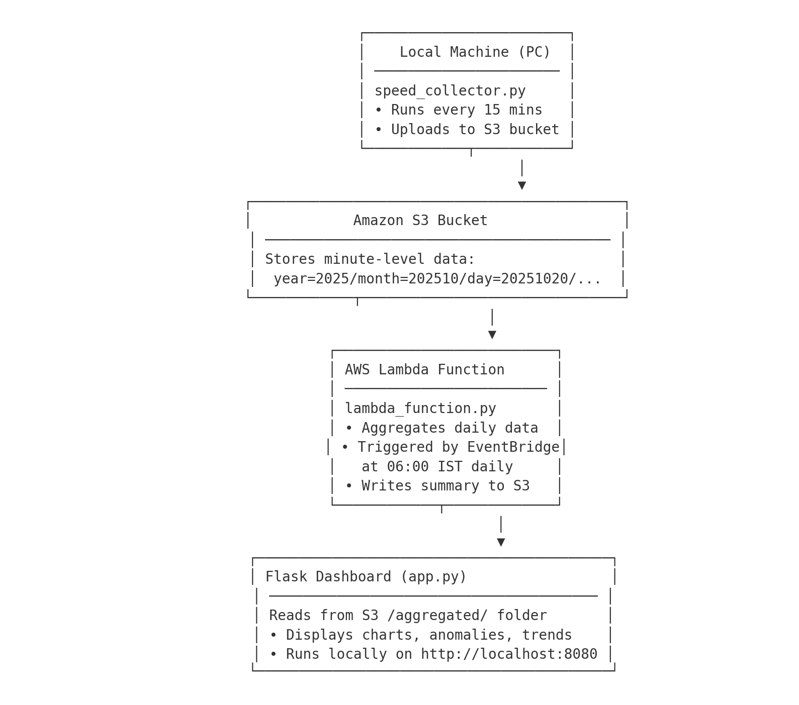

# 🚀 vd-speed-test — Internet Speed Logger & Dashboard

[]()
[]()
[]()
[]()

Measure your internet speed **every 15 minutes**, store it in **Amazon S3**, **aggregate daily at 6:00 AM IST** with **AWS Lambda**, and explore historical trends on a **beautiful Flask dashboard**, accessible **locally** or **via a Lambda Function URL**.

---

## 📦 What’s Inside

```
vd-speed-test-final-plus/
├── speed_collector.py            # Local 15-min collector (Ookla + Python speedtest)
├── daily_aggregator_local.py     # Manual daily aggregator for local testing
├── lambda_function.py            # Daily aggregator Lambda (Function URL + EventBridge)
├── lambda_dashboard.py           # Flask dashboard Lambda wrapper (via Mangum)
├── app.py                        # Flask dashboard backend
├── templates/dashboard.html      # UI template
├── requirements.txt
├── speed_collector_autostart.xml # Windows Task Scheduler config
├── template.yaml                 # AWS SAM / CloudFormation template (2 Lambdas)
└── README.md
```

---

## 🧭 Architecture



```
Local PC (Windows)
  └─ speed_collector.py  ──every 15m──▶  S3 (vd-speed-test)
                                           ├─ minute-level JSONs
                                           └─ aggregated/
AWS Lambda (daily 06:00 IST)
  └─ lambda_function.py  ──daily──────▶  aggregated/day=YYYYMMDD/speed_summary.json

Dashboard (local or serverless)
  └─ app.py / lambda_dashboard.py ◀──── reads ─── aggregated/ summaries from S3
```

---

## 🧠 How It Works

| Component | Description |
|------------|-------------|
| 🖥️ **speed_collector.py** | Runs locally every 15 minutes (aligned to IST quarter-hour). Collects Ookla + Python speedtest results, adds Mbps suffix, and uploads to S3. |
| ☁️ **lambda_function.py** | Triggered daily at 6:00 AM IST (00:30 UTC). Aggregates previous day’s results and writes a summary JSON to `/aggregated/`. |
| 🧮 **daily_aggregator_local.py** | Local version of the Lambda aggregator for quick testing. |
| 🌐 **app.py** | Flask dashboard visualizing aggregated speed data and anomalies. |
| ☁️ **lambda_dashboard.py** | Wrapper for running `app.py` on AWS Lambda via Function URL (uses `Mangum` adapter). |
| 🧱 **template.yaml** | Deploys both Lambda functions + EventBridge rule in one stack. |
| 🪟 **speed_collector_autostart.xml** | Task Scheduler config to auto-run collector at login or every 15 mins. |

---

## ⚙️ Local Setup (Windows or Mac/Linux)

### 1️⃣ Install Python & Dependencies
```bash
python -m venv .venv && .venv\Scripts\activate  # on Windows
pip install -r requirements.txt
```

### 2️⃣ Configure AWS Credentials
```bash
aws configure
```

Enter:
```
AWS Access Key ID [None]: <your-key>
AWS Secret Access Key [None]: <your-secret>
Default region name [None]: ap-south-1
Default output format [None]: json
```

Verify:
```bash
aws sts get-caller-identity
```

---

### 3️⃣ Run the Collector
```bash
python speed_collector.py
```

Uploads JSON to:
```
s3://vd-speed-test/year=2025/month=202510/day=20251022/...
```

Each JSON includes:
- download/upload speeds (with Mbps suffix)
- ping
- server info
- result URL
- public IP

---

### 4️⃣ Automate with Windows Task Scheduler

Use `speed_collector_autostart.xml`:
1. Edit `<Command>`, `<Arguments>`, and `<WorkingDirectory>` with your path.  
2. Import in **Task Scheduler → Import Task**.  
3. Under **General**, check ✅ “Run with highest privileges.”  
4. Save → Test Run → Verify.  

💡 Use `pythonw.exe` instead of `python.exe` to suppress console windows.

---

### 5️⃣ Run the Dashboard Locally

Start the Flask server:
```bash
python app.py
```

Open ➡ [http://localhost:8080](http://localhost:8080)

**Endpoints:**

| Endpoint | Method | Description |
|-----------|--------|-------------|
| `/` | `GET` | Full dashboard UI (renders `dashboard.html`) |
| `/data?days=30` | `GET` | JSON data for the last N days (default 30) |
| `/summary` | `GET` | Summary JSON (avg download/upload/ping, anomalies) |
| `/config` | `GET` | Returns configured threshold from `config.json` |
| `/reload` | `POST` | Optional endpoint to refresh cached S3 data |

---

## ☁️ AWS Lambda Deployment (Aggregator + Dashboard)

### 1️⃣ Install SAM CLI
```bash
pip install aws-sam-cli
# or on Windows:
choco install aws-sam-cli
```

### 2️⃣ From project root
```bash
sam build
sam deploy --guided
```

### 3️⃣ When prompted
```
Stack Name: vd-speedtest-stack
AWS Region: ap-south-1
Confirm changes before deploy: Y
```

✅ This deploys:
- **vd-speedtest-daily-aggregator** (daily 6 AM IST)
- **vd-speedtest-dashboard** (Flask dashboard via Function URL)

---

### 4️⃣ Access the Lambda URLs

| Lambda | Purpose | URL Example |
|---------|----------|-------------|
| `vd-speedtest-daily-aggregator` | Daily summary aggregator | `https://xxxx.lambda-url.ap-south-1.on.aws/` |
| `vd-speedtest-dashboard` | Flask dashboard served via Lambda | `https://yyyy.lambda-url.ap-south-1.on.aws/` |

Open the dashboard in any browser:
```
https://yyyy.lambda-url.ap-south-1.on.aws/
```

✅ Same Flask dashboard — now serverless, powered by AWS Lambda.

---

### 5️⃣ Test the Aggregator Function
```bash
curl.exe -X POST https://xxxx.lambda-url.ap-south-1.on.aws/
```

Output:
```json
{
  "message": "Daily aggregation complete",
  "records": 96,
  "avg_download": 94.87,
  "avg_upload": 22.61,
  "avg_ping": 17.02,
  "unique_servers": [
    "Airtel Mumbai – speedtest.mumbai.airtel.in – Mumbai (India)"
  ],
  "unique_ips": ["49.205.188.23"],
  "urls_count": 8,
  "s3_key": "aggregated/year=2025/month=202510/day=20251022/speed_summary_20251022.json"
}
```

---

## 🕓 How EventBridge Works

**Cron:**
```
cron(30 0 * * ? *)
```
🕛 00:30 UTC → 06:00 IST  
Runs daily → aggregates previous day → uploads summary to `/aggregated/`

---

## 📊 Dashboard Highlights

- 📈 Line charts for Download, Upload, and Ping trends  
- ⚠️ Red highlights for speed drops / latency spikes  
- 🧩 Filters: 7 / 14 / 30 / 60 / 90 / 180 / 360 days  
- 🧠 Threshold-based highlighting (from `config.json`)  
- 🌍 Shows all observed Public IPs  
- 🏆 Top 5 servers used in each period  

---

## 📁 S3 Structure

```
vd-speed-test/
├── year=2025/month=202510/day=20251022/hour=2025102211/minute=202510221115/
│   ├── speed_data_ookla_202510221115_*.json
│   └── speed_data_python_202510221115_*.json
└── aggregated/year=2025/month=202510/day=20251022/speed_summary_20251022.json
```

---

## 🧩 Automation Extras

| File | Description |
|------|--------------|
| **speed_collector_autostart.xml** | Runs collector every 15 mins silently via Task Scheduler |
| **lambda_dashboard.py** | Flask → AWS Lambda adapter using Mangum |
| **template.yaml** | SAM template to deploy both Lambdas |
| **samconfig.toml** | Optional preset deployment config |
| **vd-speed-test-architecture.png** | Architecture diagram |

---

## 🛡️ Notes & Tips

- Use `pythonw.exe` to suppress CLI window on Windows.
- SAM supports runtimes up to Python 3.12 (set in `template.yaml`).
- For Windows, move project out of `Downloads\Compressed` before building.
- Rotate AWS credentials regularly.
- Use `curl.exe` (not PowerShell’s `curl`) to test Function URLs.

---

## 📝 License

MIT — free to use, modify, and share.  
Contributions welcome!

---

**Made with ❤️ for reliable, human-friendly internet monitoring.**